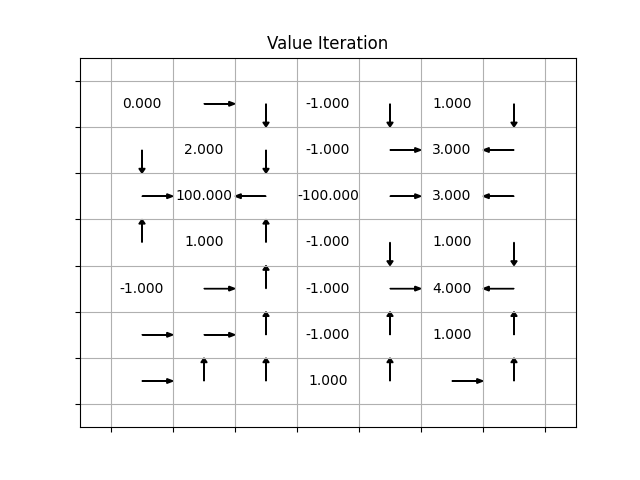
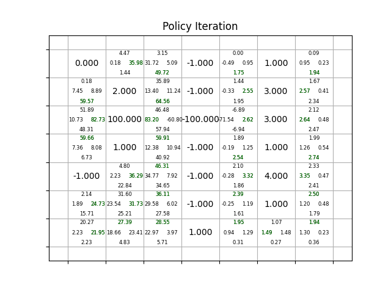

# markov decision process

scripts implementing value iteration and policy iteration to determine the optimal path for a gridworld problem.

## input

example inputs are included in this repository, and have terminal states (rewards), noise, and other features of a classic gridworld problem.

## value iteration

- initialize V(s) to arbitrary values
- repeat until V(s) converges:
    - for all states
        - for all actions, calculate the Q value
        - set V(s) to the max Q value of all actions

## policy iteration

- initialize V(s) and P(s) arbitrarily
- policy evaluation:
    - repeat until V(s) converges:
        - for each state, calculate Q value for the action P(s)
        - set V(s) to the Q value
- policy improvement:
    - for each state:
        - calculate Q for each action
        - set P(s) to the action corresponsing to the max Q
    - if P(s) is different from previous P(s), repeat policy evaluation again

